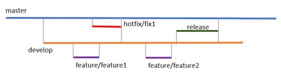

# GitFlow

1. First of all, we have the `master` branch, which contains the code that is currently in production. No developer is working directly on it. 
2. From this master branch, we create a `develop` branch, which is the branch that will contain the changes to be deployed in the next delivery of the application.
3. For each of the application's functionalities, a `feature/` branch is created \(the / will hence create a feature directory\) from the `develop` branch.
4. As soon as a feature is finished being coded, the branch of the feature is merged into the `develop` branch.
5. Then, as soon as we want to deploy all of the latest features developed, we create a `release` branch from `develop`. 
6. The `release` branch content is deployed in all environments successively.
7. As soon as the deployment in production has taken place, the `release` branch is merged with the `master` branch, and, with this merge operation, the `master` branch contains the production code. Hence, the code that is on the release branch and features branch is no longer necessary, and these branches can be deleted.
8. If a bug is detected in production, we create a `hotfix/` branch; then once the bug is fixed, we merge this branch into the `master` and `develop` branches to propagate the fix on the next branches and deployments.

## References

* Learning DevOps by Mikael Krief.
* Nvie [\(pdf\)](https://nvie.com/files/Git-branching-model.pdf)
* [https://semver.org/](https://semver.org/)

